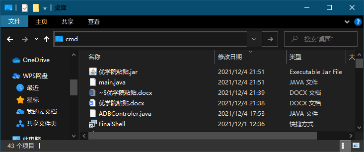
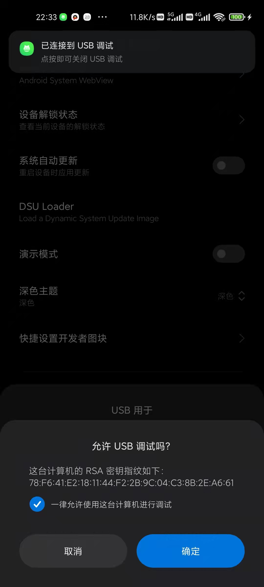
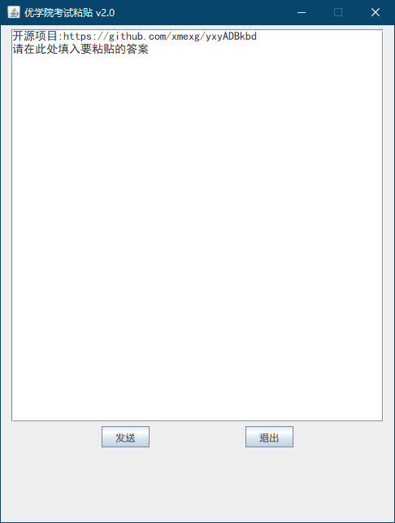
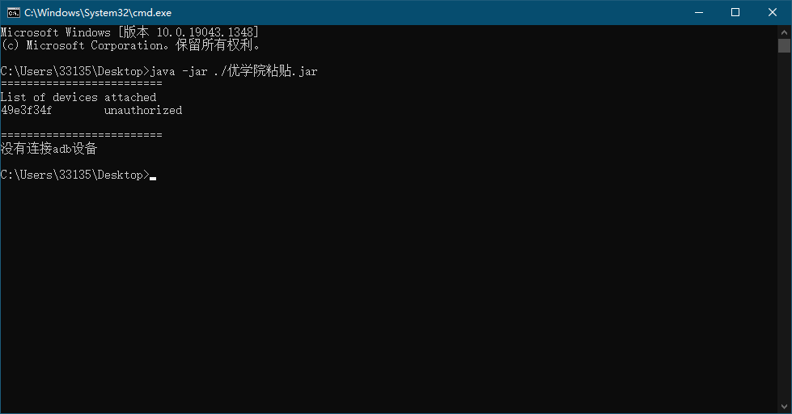
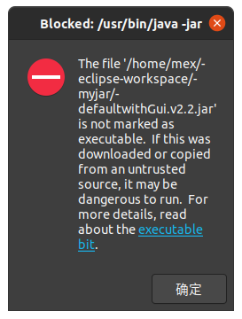
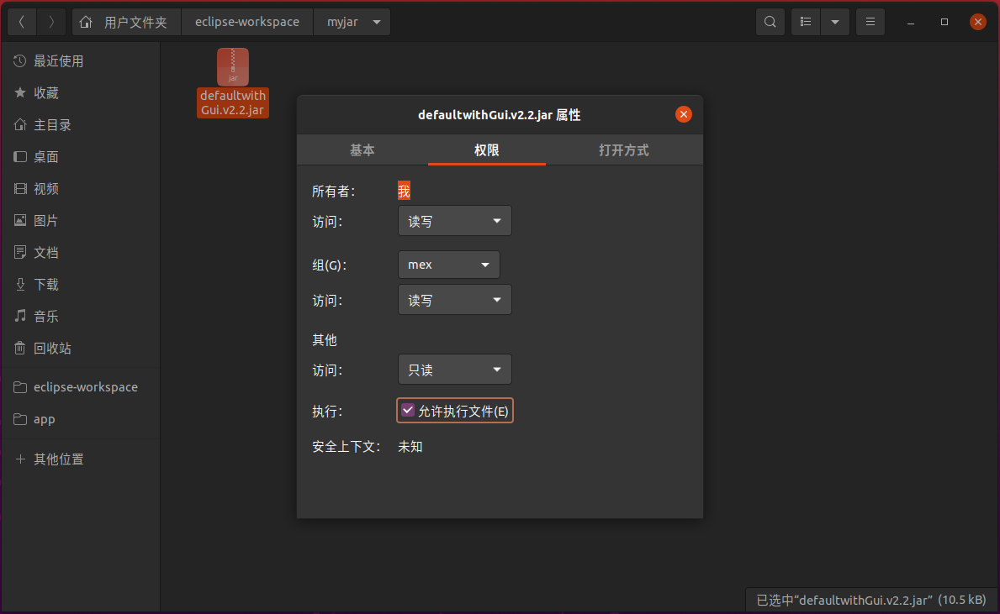
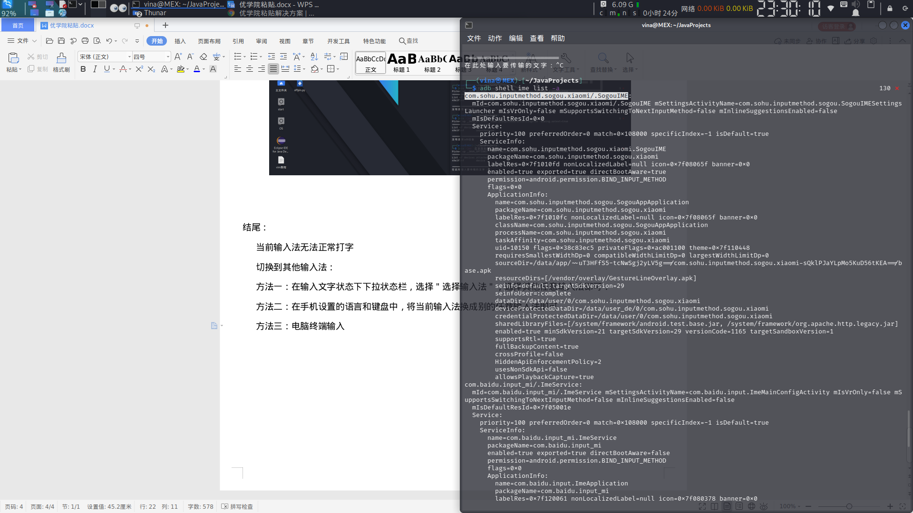
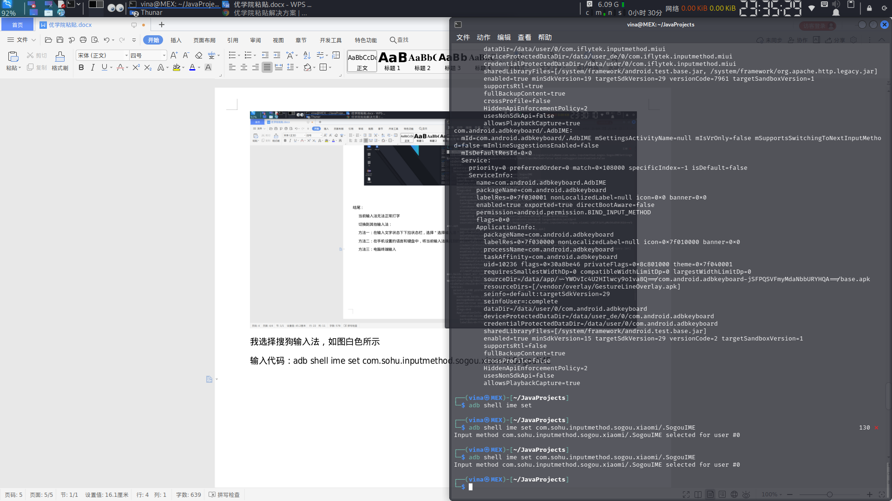

### 通过使用ADBKeyboard变相实现优学院文字粘贴 ###
优学院考试输入框无法粘贴文字，输入框每次最多输入4个汉字，通过ADBKeyboard循环每次输入1个汉字，变相实现粘贴功能

ADBKeyboard由GitHub大佬提供：https://github.com/senzhk/ADBKeyBoard ，向大佬致敬！

### v2.2展示(ubuntu)

# 正文：

### 运行环境：
- 电脑：
- java - jdk (17)
- 安卓手机，玄学问题,有的手机不可运行？？

### 手机需要做的：  
- 在v2.4开始,jar里集成了adb键盘.  
1.手机打开开发者模式
2.在开发者模式中打开 usb调试 和 通过usb安装软件 和 允许usb调试修改权限或模拟点击 选项  

### 电脑需要准备的：
- 在v2.4开始,jar里集成了windows版的adb.exe程序。linux系统需要自行安装adb  
- Windows篇：
  1. 安装java-jdk最新版：  
      官网：https://www.oracle.com/java/technologies/downloads/#java17  
      官网下载：https://download.oracle.com/java/17/latest/jdk-17_windows-x64_bin.exe
  2. 启动：    
      直接使用已打包的jar：  
        下载已打包的jar：https://github.com/xmexg/yxyADBkbd/releases/          
        打开此电脑，进入这个文件保存目录，并在文件导航栏输入cmd，回车，弹出命令行  
          
   4. 把手机通过数据线连接电脑，手机提示usb调试就点允许  
              
   5. 手机打开优学院简答题输入框。  
   6. 在v2.0(不含)后续版本开始中支持图形界面了，命令行通过　`java -jar xxx.jar`　可打开图形界面  
        
     如下情况可拔掉手机线重新连接，然后重新输入上面这条命令  
              
     当打开图形界面就启动成功了  
   7. 点击手机要输入文字的输入框，让手机处于正在输入的状态，在此处粘贴要粘贴的文字(图形界面可以输入回车，命令行界面不可输入回车)，然后按回车，他会发送到手机输入框。
      注：命令行版的空格会被自动取消,图形界面版的不用担心。  

- Linux安装：  
  先安装环境:  
  更新源:`sudo apt-get update`  
  安装jdk:`sudo apt-get install openjdk-17-jdk`   
  安装adb:`sudo apt-get install adb`  
  
  运行已打包的jar文件:
  在v2.2开始默认打开gui界面，此处以ubuntu为例，下载jar文件(https://github.com/xmexg/yxyADBkbd/releases/ )，给文件可执行权限，双击运行：  
    
    
  像使用windows那样使用这个软件。

### 结尾：
  当程序无法正常切换输入法时：  
  方法一：在输入文字状态下下拉状态栏，选择＂选择输入法＂，选择其他任意输入法即可．    
  方法二：在手机设置的语言和键盘中，将当前输入法换成别的任意输入法即可    
  方法三：  
  1. 电脑终端输入adb shell ime list -a 回车    
  2. 记下想使用的输入法的名称（每一段的开头为这个输入法的名称）  
     
  3.  我选择搜狗输入法，如图白色所示  
     
  4. 输入代码：`adb shell ime set com.sohu.inputmethod.sogou.xiaomi/.SogouIME`即可切换到该输入法  
  
### 备注：
- v2.4开始可以自定义gif，在jar同目录下创建gif文件夹并放入gif文件即可  
  示例：https://github.com/xmexg/yxyADBkbd/blob/main/files/show.mp4
